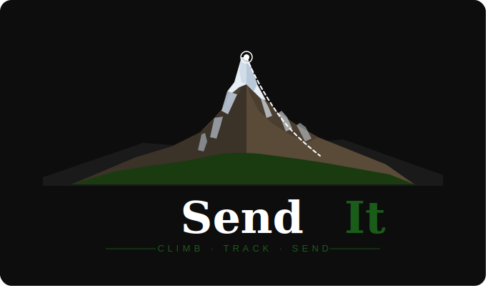

<h1 align=center> Send It </h1>
 ">
<h3 align=center> Software Development Capstone Project </h3>
<h2>What is it?</h2>

 Send It is a full stack web application that allows rock climbers to log their daily climbs, connect with friends, find local gyms, compete with others, and much more.
This is an easy, all-in-one app that can help you track your progress on your rock climbing journey. You can simply take a photo of the climb you are working on, insert
the grade, and leave a few notes regarding the climb then upload it to your profile. The ranked system allows you to compete with your friends to see you can send more climbs or harder grades every week. Out of town? no worries, find a local climbing gym easily with the gym locator feature. Do you find your self struggling to advance? Hitting a plateau? We have a built
in trainer that can help you take your climbing to the next level. Let us know what areas you are struggling with and we will give you a workout routine to help push you forward. This app
aims to be the perfect place to help climbers track climbs, make progress, and connect with friends. 

<h2>Technical Stack</h2>
<ol>
  <li>PHP</li>
  <li>JavaScript</li>
  <li>MySQL</li>
  <li> HTML </li>
  <li> CSS </li>
</ol>

